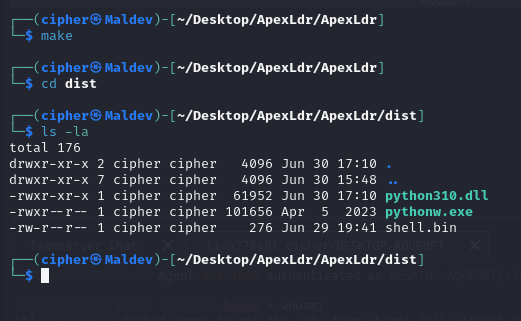
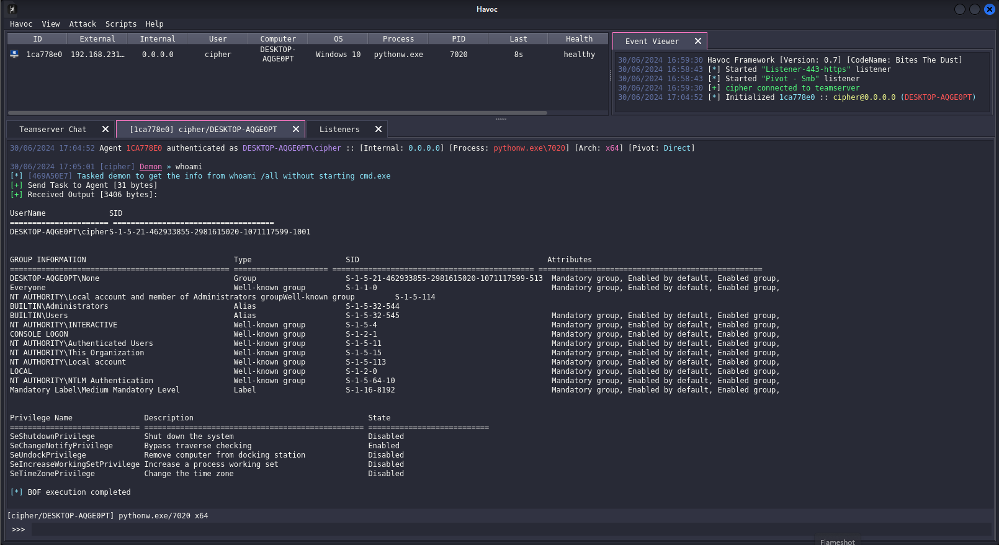

# ApexLdr

A simple DLL payload loader written in C incorporating the features I have learnt in Malware Development till now.

## Features

- DLL sideloading
- Shellcode staging via HTTP/S
- CRT Library Independent
- Indirect syscalls with Syswhispers3 - jumper_randomized
- Payload execution via Threadpool API
- DLL unhooking
- Import Address Table Camouflage
- Execution delays via API Hammering
- API Hashing

## Usage
- Clone the Repository
- Run `make` to compile the DLL
- `python310.dll` should be generated in the `dist\` folder
- Copy the `pythonw.exe` and `python310.dll` to the victim machine
- Run `pythonw.exe`
- It should DLL sideload `python310.dll` and run the shellcode

## Testing with Havoc and Windows Defender

---

## Note
> **Shellcode Encryption:** The shellcode is being fetched from a remote server, providing SSL Support. I haven't incorporated any shellcode encryption and decryption procedures to keep the loader simple and maintain a low entropy.
>
> **EDR Evasion? :** This is my first DLL Payload Loader, it can bypass many AV solutions and EDRs but some of the techniques it incorporates aren't the best, so as I keep learning I'll make better loaders!
>
> **Signature:** Use tools like Sigthief to sign the DLL payload before usage. It may help evade some AVs which focus mainly on signatures.
